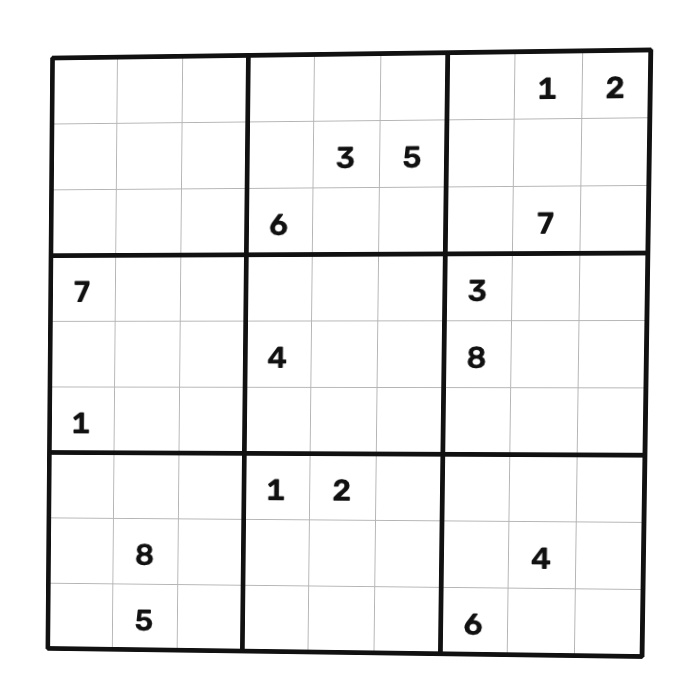

# 🧩 Sudoku Solver Pipeline

[](https://www.python.org/)
[](https://opencv.org/)
[](https://www.tensorflow.org/)
[](https://streamlit.io/)
[](LICENSE)

An end-to-end computer vision and deep learning pipeline that takes a photograph or screenshot of a printed Sudoku puzzle, extracts and deskews the grid, recognizes the pre-filled digits with per-cell confidence scoring, solves it with a backtracking algorithm, and renders the solution back onto the original photo's perspective.

**🚀 Live demo:** [sudoku-solver-0610.streamlit.app](https://sudoku-solver-0610.streamlit.app)

<p align="center">
  
</p>

---

## Why this exists

Most "sudoku solver" projects online are just the backtracking algorithm — the interesting part of this one is everything *before* the solve: getting a real, imperfect photo into a clean 9×9 grid of digits the solver can trust. That's the part that actually breaks in practice (skewed angles, uneven lighting, fonts a model's never seen), and where most of the engineering time went.

---

## Pipeline flow

| 1. Original photo | 2. Grid detected | 3. Deskewed & warped | 4. Solved overlay |
|:---:|:---:|:---:|:---:|
|  |  |  |  |

---

## How it works

**1. Grid extraction (OpenCV)**
Grayscale → Gaussian blur → adaptive thresholding to handle uneven lighting, followed by morphological dilation to close gaps in the grid lines that thresholding tends to leave. The largest 4-sided contour is taken as the puzzle boundary; its corners are ordered consistently (TL/TR/BR/BL) before a perspective transform flattens the puzzle to a clean 900×900px square, which is then sliced into 81 cells.

**2. Digit recognition (TensorFlow/Keras)**
Each cell has its outer border cleared to remove residual grid lines, then Connected Component Analysis isolates the largest ink stroke and discards noise. The digit is bounding-box cropped, rescaled, and centered for translation/scale invariance before classification. A CNN — trained on a **synthetic dataset of printed system fonts**, not MNIST — returns both a predicted digit and a softmax confidence score per cell, since handwritten-digit datasets look nothing like printed puzzle fonts.

**3. Solving (backtracking)**
Before solving, every pre-filled cell is validated against row/column/box constraints to catch a bad digit read before wasting time on a puzzle that was never valid. A textbook depth-first backtracking solver then fills the grid, with the search fully instrumented (backtrack count, solve time) rather than treated as a black box.

**4. Overlay**
The solved digits are drawn onto the flattened grid, then unwarped through the inverse perspective transform so the solution lands naturally back on the original photo — respecting whatever angle the photo was taken at.

---

## What the web app adds

The [live demo](https://sudoku-solver-0610.streamlit.app) isn't just a wrapper around the CLI — it surfaces the pipeline's internals instead of hiding them:

- **Live pipeline status** — each of the 4 stages ticks off in real time as it actually completes, not a fake progress bar
- **Confidence heatmap** — cell backgrounds tint by recognition confidence, so a shaky digit read is visible at a glance instead of buried in a log
- **Difficulty estimate** — derived transparently from clue count + backtrack count (e.g. "Hard — 27 clues, 5,077 backtracks"), not an opaque label
- **Diagonal-wave solve animation** — solved digits reveal in a sweeping wave rather than all at once
- **Sample puzzles at multiple difficulties** — try it without needing your own puzzle photo ready

---

## Known limitations

Being upfront about where this breaks, rather than only showing the happy path:

- Assumes the puzzle grid is the largest 4-sided shape in frame — cluttered backgrounds can confuse detection
- Tuned for **printed** puzzles; handwritten/pen-filled grids aren't supported
- Heavy glare or very low contrast between grid lines and background can cause detection to fail outright
- The CNN's font coverage is only as good as its synthetic training set — an unusual font may read with lower confidence (visible directly via the confidence heatmap, rather than failing silently)

---

## Installation & usage

**1. Clone and install**
```bash
git clone https://github.com/shivaansh0610-LUFFY/Sudoku-Solver.git
cd Sudoku-Solver
pip install -r requirements.txt
```

**2. (Optional) Retrain the digit classifier locally**
```bash
python digit_recognizer.py --generate   # builds synthetic_digits/
python digit_recognizer.py --train      # saves model/digit_classifier.h5
```

**3. Run via CLI**
```bash
python main.py path/to/sudoku_image.jpg
```

**4. Run the web app locally**
```bash
streamlit run app.py
```

---

## Project structure

```text
Sudoku-Solver/
├── app.py                   # Streamlit web app
├── main.py                  # CLI pipeline entry point
├── solver.py                # Backtracking solver + grid validation
├── grid_extractor.py        # OpenCV warping & cell segmentation
├── digit_recognizer.py      # Synthetic dataset generator, CNN, OCR
├── requirements.txt
├── .streamlit/config.toml   # Warm parchment theme
├── test_images/             # Sample puzzles (standard / hard / empty)
├── model/digit_classifier.h5
└── output/                  # Generated pipeline artifacts
    ├── 01_threshold.jpg
    ├── 02_contour.jpg
    ├── 03_warped.jpg
    └── 04_solved_overlay.jpg
```

---

## Roadmap

- [x] Grid extraction & perspective correction
- [x] Printed-font CNN digit classification with confidence scoring
- [x] Backtracking solver with validation & instrumentation
- [x] Inverse-perspective solution overlay
- [x] Interactive Streamlit dashboard with live pipeline status, confidence heatmap, difficulty estimate
- [ ] Handwritten digit support
- [ ] Multi-puzzle batch processing

---

## License

[MIT](LICENSE)
